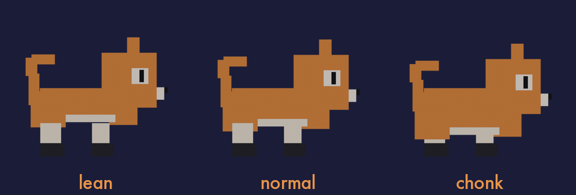
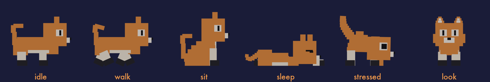

# Loaf

A desktop pet for macOS. A voxel cat lives on your dock; her body reflects how
much work you have queued, and her posture reflects what your machine is doing.

<p align="center">
  
</p>

Every sprite is rendered by a headless Blender script. Nothing is hand-drawn.

## Behaviour

**Task load sets her body size.** Incomplete reminders in Reminders.app map to
one of three weights.

<p align="center">
  
</p>

**Machine load sets her posture.** CPU or memory pressure makes her stop, hunch
and bristle. No keyboard or mouse input for a few minutes and she sleeps. The
two signals are independent, so she can be both at once.

<p align="center">
  
</p>

She also walks the dock and rests in a corner, is draggable, drops a paw from
the menu bar on system wake and every 1–2 hours, and shows speech bubbles while
idle — generated by an LLM when `LOAF_OPENROUTER_KEY` is set, from a fixed pool
otherwise.

## Requirements

macOS 14 or later and the Swift 6 command-line tools. No third-party packages.
Blender 5.2 is needed only to regenerate the art.

## Install

```bash
git clone https://github.com/Ajinkya259/Loaf
cd Loaf
make run       # build and run from source
make dist      # build dist/Loaf.app and dist/Loaf.dmg
```

The packaged app is ad-hoc signed, so macOS blocks the first launch. Right-click
→ Open once, or `xattr -dr com.apple.quarantine dist/Loaf.app`.

She is controlled from the 🐾 menu-bar item: Autopilot, Weight, Actions,
Settings.

## Permissions

One: Reminders, for task load. If denied, she keeps whatever weight was set from
the menu. No Accessibility and no Calendar access.

Network requests are made only when `LOAF_OPENROUTER_KEY` is set, for speech
bubbles, while she is idle.

## Development

```bash
make run                     # build and launch
make stop                    # quit
LOAF_STATE=sit make run      # pin one state instead of wandering

blender/build_all.sh         # regenerate all 72 sprites
python3 tools/build_showcase.py   # build loaf-showcase.html
```

Run `build_all.sh` rather than an individual build script — the poses have
drifted apart from each other twice that way.

`tools/build_showcase.py` generates `loaf-showcase.html`, a self-contained page
touring every state as a 1:1 diorama of a 1280×800 Mac. It is not checked in
(~6 MB of embedded base64); edit `loaf-showcase.src.html` and regenerate.

## Layout

```
blender/                 Blender scripts — the source of truth for the model
Sources/Loaf/            the Swift app
  Resources/sprites/<weight>/    sprites rendered directly into the app bundle
tools/package.sh         builds Loaf.app and Loaf.dmg
tools/build_showcase.py  builds loaf-showcase.html
```

| Document | Contents |
|---|---|
| [`CLAUDE.md`](CLAUDE.md) | design reference: palette, build rules, the state model, and the failure modes behind each decision |
| [`SPRITE_CONTRACT.md`](SPRITE_CONTRACT.md) | the Blender ↔ app interface: canvas size, ground line, naming |

## Limitations

- The OpenRouter key is read from `LOAF_OPENROUTER_KEY`, not the Keychain, so it
  is unavailable to "Launch at login", which starts without a shell environment.
- The packaged app is not notarized.

## Credits

[lil-cleo](https://github.com/ankitaggarwal/lil-cleo) (MIT), the reference for
the desktop-pet architecture; `blender/catlib.py` is a fork of its `bricklib`.

## License

MIT — see [LICENSE](LICENSE).
