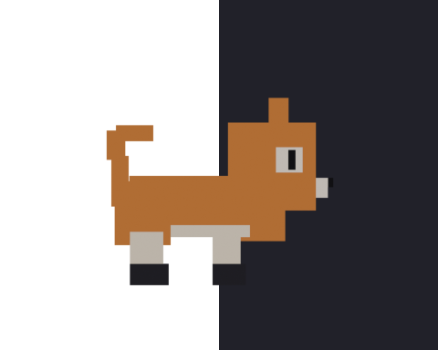

# Loaf

A voxel cat who lives on your macOS dock as a desktop pet — a status indicator
with a personality. How much work is queued changes her body. What your machine
is doing changes her mood.

<p align="center">
  
</p>

- **Task load → body size.** More (or heavier) tasks queued → she gets fatter.
  Nothing pending → lean and chill.
- **System load → posture.** CPU or memory struggling → she stops, hunches,
  bristles. Recovers → back to normal.
- Draggable. Pick her up and she wakes and looks at you; let go and she falls
  back to the dock instead of teleporting.

She's **generated, not drawn** — every sprite comes out of a headless Blender
script (`blender/build_cat*.py`). Nothing here is hand-painted, so changing her
look is one command, not a re-draw.

## Quick start

```bash
git clone https://github.com/Ajinkya259/Loaf
cd Loaf
make run
```

That's it — she appears on the dock. `make stop` to quit her, or use the 🐾
menu-bar item (state picker, weight, size, and a "React to system load"
toggle live there).

```bash
make run                        # build + launch
make stop                       # quit her
LOAF_STATE=sit make run         # pin one state for inspection instead of wandering
```

**Requirements:** macOS 14+, Xcode / Swift 6 command-line tools. Nothing else —
see [Zero dependencies](#zero-dependencies) below. Blender is only needed if
you're regenerating the art (see [Regenerating the art](#regenerating-the-art)).

## How it works

Two independent pieces:

1. **The art pipeline** (`blender/`) — headless Blender scripts build a voxel
   cat, rig it, and render every pose × body-weight combination straight into
   `Sources/Loaf/Resources/sprites/<weight>/`. There's no hand-drawing and no
   copy step between renderer and app.
2. **The app** (`Sources/Loaf/`) — a SwiftPM executable: an AppKit borderless
   window plus a SwiftUI character view, running as a menu-bar accessory app
   (no dock icon of its own — she *is* the icon). A small state machine
   (`AppDelegate+Wander.swift`) makes her stroll the dock, pause, walk to a
   corner, sit, and eventually sleep; `SystemMonitor.swift` watches CPU and
   memory pressure and interrupts all of that when the machine is struggling.

8 states currently have art — idle, walk, look, sit (front), sit (profile),
sleep, stressed, jump — each rendered at 3 body weights, 72 sprites total.

For the full design reasoning (why the camera never moves, why weight is a
directory and not a filename, why sleep gets a drifting "z" instead of a
different pose, and every failure mode that got us here), see:

| File | What's in it |
|---|---|
| [`CLAUDE.md`](CLAUDE.md) | the design reference — palette, build rules, the state model, hard-won failure classes |
| [`CONTEXT.md`](CONTEXT.md) | where things stand right now and what's next, for picking the project back up cold |
| [`SPRITE_CONTRACT.md`](SPRITE_CONTRACT.md) | the exact Blender ↔ app interface (canvas size, ground line, naming) |

### Zero dependencies

No third-party Swift packages, no CocoaPods, no npm. Just AppKit, SwiftUI, and
a folder of PNGs. She runs all day, every day, so every dependency would be
memory held the whole time, launch cost on every login, and supply-chain
surface for something that doesn't need it.

**Zero permissions requested**, too — no Accessibility, no Reminders/Calendar
(yet — see [Status](#status)).

### Resource footprint

Measured live on an M-series Mac, current build:

| | CPU | Memory (RSS) |
|---|---|---|
| Pinned / holding still | ~1.5–2% | ~13 MB |
| Wandering (default behaviour) | ~7–9% | ~25–30 MB |

CPU varies with machine load and display refresh rate — the character view
redraws on every frame it's animating, so a busy stroll costs more than
standing still. Either way: no polling loops, no background network activity,
nothing that runs when she isn't visible.

### Regenerating the art

```bash
blender/build_all.sh
```

Needs Blender 5.2.0 at `/Applications/Blender.app/Contents/MacOS/Blender`
(`brew install --cask blender`). Rebuilds every pose at every body weight and
regenerates the review contact sheets in `blender/previews/`. Always run this
script — never a single build script alone (see `CLAUDE.md` §3 for why: the
poses have drifted apart from each other twice that way).

## Status

Working today: dock stroll → dwell → corner sit → sleep, jumps, dragging,
CPU/memory-driven stress reactions, 72 sprites across 3 weights and 8 states.

Not done yet:

- **Task load is still set by hand** from the menu — the one thing standing
  between the app and the idea it was built for. Planned source is Apple
  Reminders via EventKit (see `CONTEXT.md` for the exact permission to use —
  it's not the same one as Calendar).
- **No `.app` bundle** — `make run` / `swift build` only, no drag-to-Applications
  install yet.
- Two more moods (`chill`, `wake`) are designed-but-not-built; see `CLAUDE.md`
  §6 for the intent behind them.

## Project layout

```
blender/                Blender build scripts — the source of truth for her model
Sources/Loaf/            the Swift app
  Resources/sprites/<weight>/   sprites Blender renders directly into
web/                     a Three.js live-rig previewer, for iterating on motion
                         without a full Blender render (dev tool, not shipped)
ref/lil-cleo/            reference desktop-pet implementation (gitignored, see CLAUDE.md §5)
```

See `CLAUDE.md` §2 for the full annotated tree.
